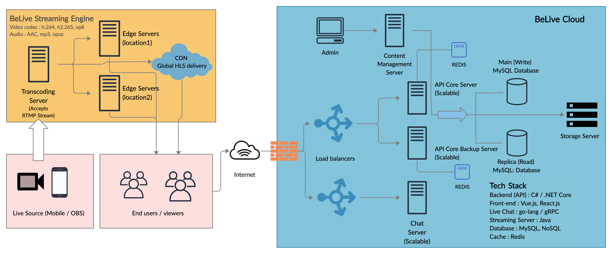
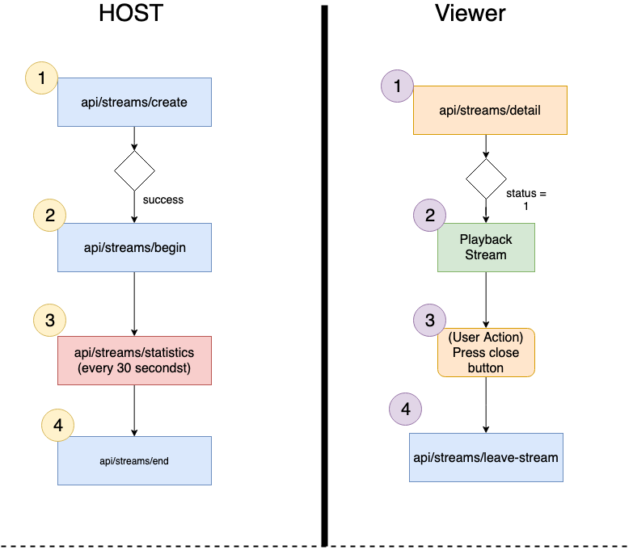
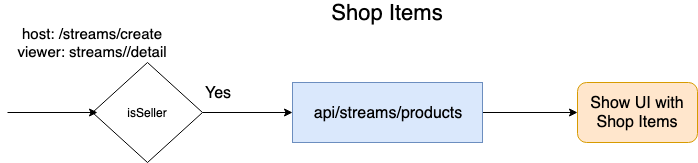
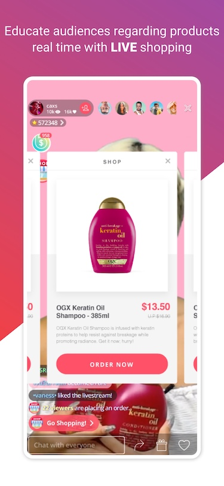

# BeLive SDK

BeLive SDK is an end-to-end live streaming solution with ready-made UI and content management system which can be integrated in your existing iOS, Android and Web apps with few lines of code. We provide top-notch customizable and flexible API as well as streaming server which supports protocols such as RTMP, HLS and WebRTC, with deployment option on bare metal or on public cloud provider's infrastructure in a virtual machine or in a docker container.

> Throughout this document we will refer to host / broadcaster as source of live stream while viewer or audience as consumer/watcher of live or recorded stream

## SDK Architecture



## API Flow Diagram






## Features

BeLive SDK provides following core features with flexibility to extend and add-on more features.

- Start live stream using iOS or Android device 
- Watch live stream on any iOS or Android device. In addition, we also support playback on web browser
- Record and encode live stream (HLS or mp4 format)
- Beauty filter for enhancing the live stream experience 
- Live chat for interactivity during live stream
- Per minute stream statistics (live view count and likes) 
- Watcher list with ability to view profile and photo 
- Live shopping feature with unlimited shop items / products
- Multiple resolutions supports such as SD, HD and Full HD 
- Stream Password feature for enhanced security and personalization
- Content Management Sytem to manage stream and live shopping

## SDK Package 

SDK Package contains following core components

### Server/backend/DevOps
- API Server docker container for easy deployment
- CMS Server docker container easy deployment
- Database Tables and config for easy setup on MySQL server
- Chat Server docker container for easy deployment
- Wowza scripts for easy deployment

### Mobile Apps

- Android SDK with sample code
- iOS SDK (framework) with Sample Code

## Web App

- Docker image for easy deployment
- Javascript plugin for custom UI integration in your existing Web App

## Ready-made UI
Our SDK provides ready-to-use live stream UI for any mobile device screen size. We provide customization option as per client's need and usage. Refer to below screenshots 





## SDK Code Example

### Android (Kotlin)

1. In `onCreate()` method of `MainApplication`, add following line of code 

```kotlin
class MainApplication : Application() {

    override fun onCreate() {
        super.onCreate()

        BelivePlayerUtil.initWorkspace(this)
    }
}

```

2. Initialize BeLive SDK in `MainActivity` of your app 

```kotlin
private fun initBeliveSdk() {
        val userId = "userId"
        val username = "userName"
        BeliveSdkInitialization.Builder(this)
            .setUserId(userId)
            .setUsername(username)
            .setUserDisplayName(username)
            .setUserAvatarUrl("profile.jpg")
            .setInitCallback(object: BeliveSdkInitialization.BeliveSdkInitCallback{
                override fun onFinished(status: BeliveInitStatus.Status, message: String?) {
                    when(status){
                        BeliveInitStatus.Status.INITIALIZATION_SUCCESS -> {

                                doUpdateUI()
                                canStartLive = true
                        }
                        BeliveInitStatus.Status.INITIALIZATION_LOGIN_FAILED -> {
                            
                            // failed to login
                        }
                        else -> { }
                    }
                }
            }).build().init()
    }

```

3. Start Live stream or watch live stream using following lines of code

```kotlin
btnGoLive.setOnClickListener {
            val customShareTextAndUrl = "custom share text and url" // optional. Leave it empty for default behavior
            BeliveSdkNavigator.instance().goLive(this, StreamQualityOptions.STREAM_QUALITY_SHOW, customShareTextAndUrl)
        }

``` 
```kotlin
btnJoinRoom.setOnClickListener {
            val slug = "stream_slug" // leave it empty if you want title and password screen
            val customShareTextAndUrl = "custom share text and url" // optional. Leave it empty for default behavior
            BeliveSdkNavigator.instance().joinRoom(this, slug, customShareTextAndUrl)

        }
```

For quick start, visit [Quickstart For Android](android/QuickStart.md)

For Advance guide, visit [Advance Guide with Custom UI for Android](android/Advance.md)

###  iOS (Swift)

SDK provides join live or go live navigation controller out of the box. See the below code for navigating user to host or viewer controller.

```swift
class MainViewController: BaseViewController {

    let goLiveAndJoinRoom = GoLiveAndJoinViewController()
        fileprivate var shoul_rotate: Bool = false
        var isStatusBarHidden: Bool = false {
            didSet{
                UIView.animate(withDuration: 0.5) { () -> Void in
                    self.setNeedsStatusBarAppearanceUpdate()
                }
            }
        }
        override func viewDidLoad() {
            super.viewDidLoad()

            self.navigationController?.setNavigationBarHidden(true, animated: true)
            isStatusBarHidden = true
            self.addChild(goLiveAndJoinRoom)
            addChildToContainer(parent: self.view, child: goLiveAndJoinRoom.view)
            goLiveAndJoinRoom.didMove(toParent: self)
            
            }
   }

```

For quick start, visit [Quickstart For iOS](ios/QuickStart.md)

For Advance guide, visit [Advance Guide with Custom UI for iOS](ios/Advance.md)

### Web (Javascript)

For quick start, visit [Quickstart For Web](web/QuickStart.md)

For Advance guide, visit [Advance Guide for Web SDK](web/Advance.md)