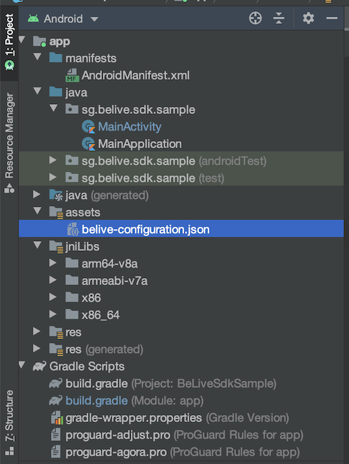
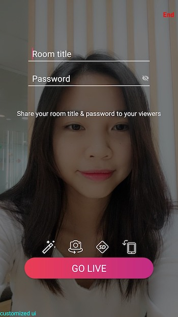
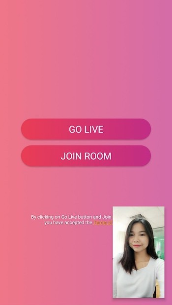

# Quick Start
This quick start shows a brief overview of the BeLive SDK's structure and features, then goes through the steps of integrating the BeLive SDK in your own project.

> Note : Throughout this document we will refer `host` or `broadcaster` term alternatively for referring to feature where user can start live stream. Similary, we will refer `viewer` or `watcher` alternatively for user who is watching live or recorded stream.

## Sample App

Our sample application demonstrates the capabilities and core features of the BeLive SDK for Android. It is provided for developer educational purposes. Contact our [Business team](https://www.tech.belive.sg/contact-us) for source code. You can use it as starting point for building new app. 

## Requirements 

- BeLive SDK **aar** and **so** files  (In Sample app they are located in `app/libs` and `app/src/main/jniLibs/`folder)
- Latest version of Android Studio (4.2 as of today)
- `Android 4.4 and above` (API Level 19 or later)
- `Java 8`

## Install and configure BeLive SDK

Follow the below steps to integrate BeLive SDK in your app.

### Step 1: Install SDK 

Copy `aar` libs fils in `app/libs` folder of your project, add following lines in `build.gradle`

Project level `build.gradle`

```gradle
repositories {
        ....
        flatDir {
            dirs 'libs'
        }
        
    }
```

App level `build.gradle`

For both **Host and Viewer**, add following aar files.

```gradle
dependencies {
    // sdk aar files
    implementation (name:'belive-streaming-release', ext:'aar')
    implementation (name:'beliveplayer-release', ext:'aar')
    implementation (name:'belive-core-release', ext:'aar')
    implementation (name:'common-release', ext:'aar')

}

```
For **Host** only, you can exclude `beliveplayer-release` aar library but for `Viewer` implementation, you will need all `aar` libraries.


BeLive Android SDK is using open source libraries. Add following depdendcies to app level `build.gradle`

For detailed explanation about Third party libraries used in SDK, visit [Third Party Libraries](Third-Party-Libs.md)

**Host and Viewer**

```gradle
dependencies {

    // Common libraries for both host and viewer

    // coroutines : Use for Async tasks
    implementation "org.jetbrains.kotlinx:kotlinx-coroutines-android:1.3.6"
    implementation "org.jetbrains.kotlinx:kotlinx-coroutines-core:1.3.6"

    //dependency injection koin
    api 'org.koin:koin-androidx-scope:2.1.5'
    api 'org.koin:koin-androidx-viewmodel:2.1.5'

    // lifecycle : For lifecycle aware components
    implementation "androidx.lifecycle:lifecycle-extensions:2.2.0-rc02"
    implementation "androidx.lifecycle:lifecycle-viewmodel-ktx:2.2.0-rc02"
    implementation "androidx.lifecycle:lifecycle-livedata-ktx:2.2.0-rc02"
    implementation "androidx.lifecycle:lifecycle-runtime-ktx:2.2.0-rc02"

    // retrofit : Type safe HTTP client for Android
    implementation "com.squareup.retrofit2:retrofit:2.6.1"
    implementation "com.squareup.retrofit2:converter-gson:2.6.1"
    implementation "com.squareup.okhttp3:logging-interceptor:3.10.0"
    implementation 'com.facebook.stetho:stetho-okhttp3:1.5.1'

    //chat : Real time chat depdendencies 
    // In-house
    implementation 'io.grpc:grpc-okhttp:1.26.0'
    implementation 'io.grpc:grpc-protobuf-lite:1.26.0'
    implementation 'io.grpc:grpc-stub:1.26.0'
    implementation 'javax.annotation:javax.annotation-api:1.3.2'
    // Agora
    implementation 'com.github.agorabuilder:rtm-sdk:1.4.3'

    //log : For debug logs
    implementation 'com.jakewharton.timber:timber:4.7.1'

    // Image loading
    implementation 'com.github.bumptech.glide:glide:4.10.0'
    kapt 'com.github.bumptech.glide:compiler:4.10.0'

    // misc : Utility libraries for UI
    implementation 'com.google.code.gson:gson:2.8.6'
    implementation 'androidx.swiperefreshlayout:swiperefreshlayout:1.0.0'
    implementation 'com.hannesdorfmann:adapterdelegates4-kotlin-dsl:4.2.0'

    // Host only libraries 

    // Streamer : Libraries for pushing RTMP to streaming server for transcoding
    implementation 'com.ksyun.media:libksylive-java:3.0.4'
    implementation 'com.ksyun.media:libksylive-armv7a:3.0.4'
    implementation "com.ksyun.media:libksylive-arm64:3.0.2"
    implementation "com.ksyun.media:libksylive-x86:3.0.2"

    // Viewers only libraries 

    // exoplayer : Required for playback of streams
    implementation 'com.google.android.exoplayer:exoplayer:2.9.6'
    implementation 'com.google.android.exoplayer:exoplayer-dash:2.9.6'
    implementation 'com.google.android.exoplayer:extension-rtmp:2.9.6'
    implementation 'com.google.android.exoplayer:exoplayer-ui:2.9.6'

}
```

**Host only**

```gradle
dependencies {

    // Common libraries for both host and viewer

    // coroutines : Use for Aync tasks
    implementation "org.jetbrains.kotlinx:kotlinx-coroutines-android:1.3.6"
    implementation "org.jetbrains.kotlinx:kotlinx-coroutines-core:1.3.6"

    //dependency injection koin
    api 'org.koin:koin-androidx-scope:2.1.5'
    api 'org.koin:koin-androidx-viewmodel:2.1.5'

    // lifecycle : For lifecycle aware components
    implementation "androidx.lifecycle:lifecycle-extensions:2.2.0-rc02"
    implementation "androidx.lifecycle:lifecycle-viewmodel-ktx:2.2.0-rc02"
    implementation "androidx.lifecycle:lifecycle-livedata-ktx:2.2.0-rc02"
    implementation "androidx.lifecycle:lifecycle-runtime-ktx:2.2.0-rc02"

    // retrofit : Type safe HTTP client for Android
    implementation "com.squareup.retrofit2:retrofit:2.6.1"
    implementation "com.squareup.retrofit2:converter-gson:2.6.1"
    implementation "com.squareup.okhttp3:logging-interceptor:3.10.0"
    implementation 'com.facebook.stetho:stetho-okhttp3:1.5.1'

    //chat : Real time chat depdendencies 
    // In-house
    implementation 'io.grpc:grpc-okhttp:1.26.0'
    implementation 'io.grpc:grpc-protobuf-lite:1.26.0'
    implementation 'io.grpc:grpc-stub:1.26.0'
    implementation 'javax.annotation:javax.annotation-api:1.3.2'
    // Agora
    implementation 'com.github.agorabuilder:rtm-sdk:1.4.3'

    //log : For debug logs
    implementation 'com.jakewharton.timber:timber:4.7.1'

    // Image loading
    implementation 'com.github.bumptech.glide:glide:4.10.0'
    kapt 'com.github.bumptech.glide:compiler:4.10.0'

    // misc : Utility libraries for UI 
    implementation 'com.google.code.gson:gson:2.8.6'
    implementation 'androidx.swiperefreshlayout:swiperefreshlayout:1.0.0'
    implementation 'com.hannesdorfmann:adapterdelegates4-kotlin-dsl:4.2.0'

    // Host only libraries 

    // Streamer : Libraries for pushing RTMP to streaming server for transcoding
    implementation 'com.ksyun.media:libksylive-java:3.0.4'
    implementation 'com.ksyun.media:libksylive-armv7a:3.0.4'
    implementation "com.ksyun.media:libksylive-arm64:3.0.2"
    implementation "com.ksyun.media:libksylive-x86:3.0.2"

}
```

**Viewer only**


```gradle

    // Common libraries for both host and viewer

    // coroutines : Use for Aync tasks
    implementation "org.jetbrains.kotlinx:kotlinx-coroutines-android:1.3.6"
    implementation "org.jetbrains.kotlinx:kotlinx-coroutines-core:1.3.6"

    //dependency injection koin
    api 'org.koin:koin-androidx-scope:2.1.5'
    api 'org.koin:koin-androidx-viewmodel:2.1.5'

    // lifecycle : For lifecycle aware components
    implementation "androidx.lifecycle:lifecycle-extensions:2.2.0-rc02"
    implementation "androidx.lifecycle:lifecycle-viewmodel-ktx:2.2.0-rc02"
    implementation "androidx.lifecycle:lifecycle-livedata-ktx:2.2.0-rc02"
    implementation "androidx.lifecycle:lifecycle-runtime-ktx:2.2.0-rc02"

    // retrofit : Type safe HTTP client for Android
    implementation "com.squareup.retrofit2:retrofit:2.6.1"
    implementation "com.squareup.retrofit2:converter-gson:2.6.1"
    implementation "com.squareup.okhttp3:logging-interceptor:3.10.0"
    implementation 'com.facebook.stetho:stetho-okhttp3:1.5.1'

    //chat : Real time chat depdendencies 
    // In-house
    implementation 'io.grpc:grpc-okhttp:1.26.0'
    implementation 'io.grpc:grpc-protobuf-lite:1.26.0'
    implementation 'io.grpc:grpc-stub:1.26.0'
    implementation 'javax.annotation:javax.annotation-api:1.3.2'
    // Agora
    implementation 'com.github.agorabuilder:rtm-sdk:1.4.3'

    //log : For debug logs
    implementation 'com.jakewharton.timber:timber:4.7.1'

    // Image loading
    implementation 'com.github.bumptech.glide:glide:4.10.0'
    kapt 'com.github.bumptech.glide:compiler:4.10.0'

    // misc : Utility libraries for UI 
    implementation 'com.google.code.gson:gson:2.8.6'
    implementation 'androidx.swiperefreshlayout:swiperefreshlayout:1.0.0'
    implementation 'com.hannesdorfmann:adapterdelegates4-kotlin-dsl:4.2.0'

    // Viewers only libraries 

    // exoplayer : Required for playback of streams
    implementation 'com.google.android.exoplayer:exoplayer:2.9.6'
    implementation 'com.google.android.exoplayer:exoplayer-dash:2.9.6'
    implementation 'com.google.android.exoplayer:extension-rtmp:2.9.6'
    implementation 'com.google.android.exoplayer:exoplayer-ui:2.9.6'

```

> You can skip libraries which are already added in your `build.gradle`. In case of any conflict, let us know and our team will check for comptability with SDK.

Add `jniLibs` in your project. You can find pre-compiled `so` binaries in SDK folder. Copy them to `app/src/main/jniLibs`. In your `MainActivity` or before start using Live Streaming part, add following line of code 

```kotlin
 System.loadLibrary("native-lib")
```

> Note : Without adding jniLibs, BeLiveSDK library will not load and throw an exception

### Step 2: Grant system permissions 

BeLive SDK requires system permissions. To grant system permissions such as camera, microphone and others, We have added the following permissions in our `aar` library. No action is required on your side.

> Note : Host requires additional permissions for live stream.

```xml
    <!-- Host and Viewer -->
    <uses-permission android:name="android.permission.INTERNET" />
    <uses-permission android:name="android.permission.ACCESS_NETWORK_STATE" />
    <uses-permission android:name="android.permission.READ_EXTERNAL_STORAGE" />
    <uses-permission android:name="android.permission.WRITE_EXTERNAL_STORAGE" />

   <!-- Host only -->
    <uses-permission android:name="android.permission.RECORD_AUDIO" />
    <uses-permission android:name="android.permission.CAMERA" />
    <uses-permission android:name="android.permission.FLASHLIGHT" />
    <uses-permission android:name="android.permission.MODIFY_AUDIO_SETTINGS" />

    
```

> For more information about permissions, see [official guide](https://developer.android.com/training/permissions/requesting.html)

### Step 3: Add SDK configuration in build.gradle and AndroidManifest.xml

Obtain license key from business team by providing your package Id. Add following variables to app level `build.gradle`

```gradle
android {

        def beliveSdkApiDomain = "https://api.yourdomain.com"
        def beliveSdkWozaBroadCastUrl = "rtmp://wowza-host.yourdomain.com:1935/live?doPublish=password/%s"
        def beliveSdkWozaViewerUrl = "rtmp://wowza-view.yourdomain.sg:1935/liveedge?doPlay=password/%s_aac"
        def beliveSdkChatServerDomain = "rtm.yourdomain.com"
        def beliveSdkChatServerPort = 443
        def beliveSdkId = "beliveId"
        def isBuildHasSML = false
        def beliveSdkLicense = "license_key"

        manifestPlaceholders = [
                beliveSdkApiDomain: beliveSdkApiDomain,
                beliveSdkWozaBroadCastUrl: beliveSdkWozaBroadCastUrl,
                beliveSdkWozaViewerUrl: beliveSdkWozaViewerUrl,
                beliveSdkChatServerDomain: beliveSdkChatServerDomain,
                beliveSdkChatServerPort: beliveSdkChatServerPort,
                beliveSdkId: beliveSdkId,
                isBuildHasSML: isBuildHasSML,
                beliveSdkLicense: beliveSdkLicense
        ]
}
```


> If you haven't deployed api, chat and streaming servers, you can use `endpoints` that We have provided in Sample app for testing.

Add following lines in `AndrodiManifes.xml` before closing `<application>` tag. 

```xml
        <!-- belive sdk configuration here-->
        <meta-data
            android:name="sg.belive.sdk.beliveSdkApiDomain"
            android:value="${beliveSdkApiDomain}" />
        <meta-data
            android:name="sg.belive.sdk.beliveSdkWozaBroadCastUrl"
            android:value="${beliveSdkWozaBroadCastUrl}" />
        <meta-data
            android:name="sg.belive.sdk.beliveSdkWozaViewerUrl"
            android:value="${beliveSdkWozaViewerUrl}" />

        <meta-data
            android:name="sg.belive.sdk.beliveSdkChatServerDomain"
            android:value="${beliveSdkChatServerDomain}" />

        <meta-data
            android:name="sg.belive.sdk.beliveSdkChatServerPort"
            android:value="${beliveSdkChatServerPort}" />

        <meta-data
            android:name="sg.belive.sdk.beliveSdkId"
            android:value="${beliveSdkId}" />

        <meta-data
            android:name="sg.belive.sdk.isBuildHasSML"
            android:value="${isBuildHasSML}" />


        <meta-data
            android:name="sg.belive.sdk.beliveSdkLicense"
            android:value="${beliveSdkLicense}" />
        <!-- end belive sdk configuration here-->

        <!-- Optional Facebook settings for share feature -->
        <!--
        <provider
            android:name="com.facebook.FacebookContentProvider"
            android:authorities="com.facebook.app.FacebookContentProvider123459"
            android:exported="false" />

        <meta-data
            android:name="com.facebook.sdk.ApplicationId"
            android:value="@string/facebook_app_id" />
        -->


```

> Note that Facebook config is optional. We use Facebook share sdk for sharing live stream url.

To enable Facebook sharing, add Facebook App Id in `strings.xml` and uncomment Facebook provider and meta-data tags in `AndroidManifest.xml`

```xml
<string name="facebook_app_id">REPLACE_HERE</string>
```

> Without adding Facebook App Id and relevant lines in manifest, app will crash when user tries to share a stream. Alternatively, we also provide default Android sharesheet.

### Step 4: SDK feature configuration

BeLive SDK has plenty of features. By default all features are enabled. You can disable them by using a `json` file.  Create a new file `belive-configuration.json` in folder `app/src/main/assets`. 

```json
{
  "features": {
    "watcherList": true,
    "beautyFilter": true,
    "floatingText": true,
    "shareButton": true,
    "streamQuality": 1,
    "streamPassword": true,
    "allowPictureInPicture": true,
    "shoppingCart": true,
    "obs": false
  }
}
```

> Note : `belive-configuration.json` is required for both Host and Viewer.

**StreamQuality : 1** will show options for host to choose among SD, HD or FHD in prelive screen. For other options refer to below object. 

```kotlin
StreamQualityOptions{
    const val STREAM_QUALITY_SHOW = 1
    const val STREAM_QUALITY_HIDE_AND_FIXED_SD = 2
    const val STREAM_QUALITY_HIDE_AND_FIXED_HD = 3
    const val STREAM_QUALITY_HIDE_AND_FIXED_FHD = 4
}
```

**allowPictureInPicture: true** enables picture-in-picture mode.

Other options are self-explanatory. For **How to use OBS**, get in touch with our business team to get detailed guide.

After completing all steps you will see following project structure 



## [Host] Start your first Live Stream

BeLive SDK adds live streaming feature to your client app with few lines of code. To start or watch your first live stream, do the following steps. 

### Step 1: Initialize the BeLive SDK in your app

`BelivePlayerUtil` must be initialized before iniating any connection with BeLive SDK. It is recommended to initialize it in the `onCreate()` method of the main `Application` or `Activity`. Find below an example of initializing workspace in MainActivity.

```kotlin
class MainActivity : AppCompatActivity() {

    override fun onCreate(savedInstanceState: Bundle?) {
        super.onCreate()

        BelivePlayerUtil.initWorkspace(this)
    }
}
```

There are couple of additional steps that needs to be done before we can start using functionality of SDK. First of all, we have to load native library which contains license file check, after that we have to initialize provider and ImageLoader. The main reason for using external ImageLoader is to use consisent settings of Glide (third party image loading ibrary).

```kotlin
class MainActivity : AppCompatActivity() {

    override fun onCreate(savedInstanceState: Bundle?) {
        super.onCreate()

        BelivePlayerUtil.initWorkspace(this)
        System.loadLibrary("native-lib")
        val provider = BeliveSdkInitProvider(this.applicationContext)
        provider.initBeLiveSdk(object: BeliveSdkInitProvider.ISDKInitStatus{
            override fun onStatus(status: String, error: BeliveException?) {
            }
        })
        LbsImageLoaderUtil.registerImageLoader(ImageLoaderImpl())
    }
}
```

In `MainActivity` class, initialze BeLiveSDK by providing `userId`, `userName`, `displayName` and relative `userAvatarUrl`. 

> Note that it is must to initialze SDK before starting live stream activities.

```kotlin

private fun initBeliveSdk() {
        val userId = "userId"
        val username = "userName"
        BeliveSdkInitialization.Builder(this)
            .setUserId(userId)
            .setUsername(username)
            .setUserDisplayName(username)
            .setUserAvatarUrl("profile.jpg")
            .setInitCallback(object: BeliveSdkInitialization.BeliveSdkInitCallback{
                override fun onFinished(status: BeliveInitStatus.Status, message: String?) {
                    when(status){
                        BeliveInitStatus.Status.INITIALIZATION_SUCCESS -> {

                                doUpdateUI()
                                canStartLive = true
                        }
                        BeliveInitStatus.Status.INITIALIZATION_LOGIN_FAILED -> {
                            
                            // failed to login
                        }
                        BeliveInitStatus.Status.INITIALIZATION_REGISTER_FAILED -> {
                            // failed to register
                        }
                        BeliveInitStatus.Status.INITIALIZATION_LOAD_CONFIG_FAILED -> {
                            // load config failed
                        }
                        else -> { }
                    }
                }
            }).setBeliveSdkLiveStreamCallback(object : BlsLiveStreamCallback {

                override fun onObsCreated(slug: String) {
                        // OBS stream key
                }
                override fun onDuration(duration: Long) {
                    // duration information for stream
                }
                override fun onEndStreamError(code: Int, message: String) {

                    // Error information related to ending stream on Host side
                }
                override fun onEndStreamSuccess(slug: String, statistics: BlsLiveStreamStatistics) {

                }
                override fun onJoinStreamSuccess() {

                    // Viwer has joined live/recorded stream sucessfully
                }
                override fun onSaveStreamError(code: Int, message: String) {

                    // Host has failed to save stream
                }
                override fun onSaveStreamSuccess() {
                }
                override fun onStartStreamError(code: Int, message: String) {
                }
                override fun onStartStreamSuccess(slug: String) {
                }
                override fun onStatistics(statistics: BlsLiveStreamStatistics) {

                    // Get statistics update very 20-30 seconds (view count etc.)

                }
                override fun onStreamError(reason: Int) {
                }
                override fun onViewerJoined(it: List<ViewerInfo>) {
                }

                override fun onViewerLeft(it: ViewerInfo) {
                }
            }).build().init()
    }

```


### Step 2: Start Live Stream 

Use following snippet of code for starting live stream actitivty 

```kotlin
btnGoLive.setOnClickListener {
            val customShareTextAndUrl = "custom share text and url" // optional. Leave it empty for default behavior
            BeliveSdkNavigator.instance().goLive(this, StreamQualityOptions.STREAM_QUALITY_SHOW, customShareTextAndUrl)
        }

```        

> Note `customShareTextAndUrl` is optional. Leave it empty for using default behavior of SDK

See screenshots below for default UI. For custom UI developement, visit [Advance Guide with Custom UI for Android](Advance.md)

 | 

### Step 3: Watch Live Stream

Use following snippet of code for watching live stream. By default, it will take you to title and password screen. You can skip title and password screen by entering slug of stream.

```kotlin
btnJoinRoom.setOnClickListener {
            val slug = "stream_slug" // leave it empty if you want title and password screen
            val customShareTextAndUrl = "custom share text and url" // optional. Leave it empty for default behavior
            BeliveSdkNavigator.instance().joinRoom(this, slug, customShareTextAndUrl)

        }
```
Screenshot of default watch live stream Activity. It is similar to that of host/broadcaster.

 |  


### Step 4: Add Callbacks for host and viewer flow

Most of the logic of live stream is handled internally by the SDK, however we do provide callbacks for certain events during Live stream.

Find below a list of callback methods.

```kotlin
interface BlsLiveStreamCallback {
     /*obs*/
    fun onObsCreated(slug: String)

    fun onStartStreamSuccess(slug: String)  // for host. User has started stream
    fun onDuration(duration: Long) // current duration of the stream
    fun onJoinStreamSuccess() // for viewer only. User has joined stream
    fun onStreamError(reason: Int) // for both host and viewer
    fun onStatistics(statistics: BlsLiveStreamStatistics) // for both host and viewer. Update of view count and like count.
    fun onShareStream(shareTo: Int) // for both host and viewer
    fun onEndStreamSuccess(slug: String, statistics: BlsLiveStreamStatistics) // for host only. User has ended live stream
    fun onEndStreamError(code: Int, message: String) // for host only. Host has failed to end live stream
    fun onSaveStream(isSaved: Boolean) // for host only. Host has saved live stream
    fun onSaveStreamError(code: Int, message: String) // for host only. Host has failed to save live stream
    fun onStartStreamSuccess(slug: String) // for host only.
    fun onStartStreamError(code: Int, message: String) // for host only. Failed to start stream
    fun onViewerJoined(it: List<ViewerInfo>)
    fun onViewerLeft(it: ViewerInfo)
}
```

For `onStreamError` reasons, refer to codes below 

```kotlin
const val STREAMER_CAMERA_ERROR_UNKNOWN = -2001
const val STREAMER_CAMERA_ERROR_START_FAILED = -2002
const val STREAMER_CAMERA_ERROR_EVICTED = -2007
const val STREAMER_AUDIO_RECORDER_ERROR_START_FAILED = -2003
const val STREAMER_AUDIO_RECORDER_ERROR_UNKNOWN = -2005
const val STREAMER_CAMERA_ERROR_SERVER_DIED = -2006
const val STREAMER_FILE_PUBLISHER_CLOSE_FAILED = -4003
const val STREAMER_FILE_PUBLISHER_ERROR_UNKNOWN = -4000
const val STREAMER_FILE_PUBLISHER_OPEN_FAILED = -4001
const val STREAMER_FILE_PUBLISHER_FORMAT_NOT_SUPPORTED = -4004
const val STREAMER_FILE_PUBLISHER_WRITE_FAILED = -4002
const val STREAMER_VIDEO_ENCODER_ERROR_UNSUPPORTED = -1004
const val STREAMER_VIDEO_ENCODER_ERROR_UNKNOWN = -1003
```

To add callbacks in your project, add following code to BeliveSdkInitialization code.

```kotlin

BeliveSdkInitialization.Builder(this)
.setBeliveSdkLiveStreamCallback(object : BlsLiveStreamCallback { 
    // callback functions
}
```

## Proguard files 

We have added proguard files in sample app, copy them in your project for release build. 

## Custom UI

> For advance guide with custom UI, visit [Advance guide with Custom UI](Advance.md)
