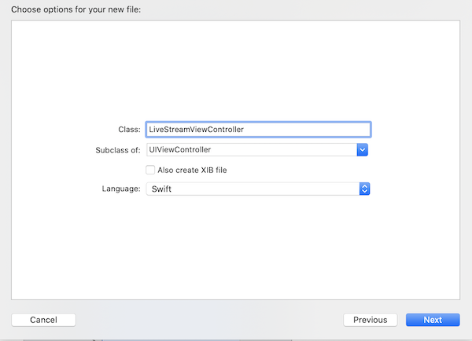
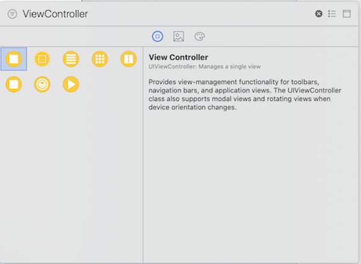
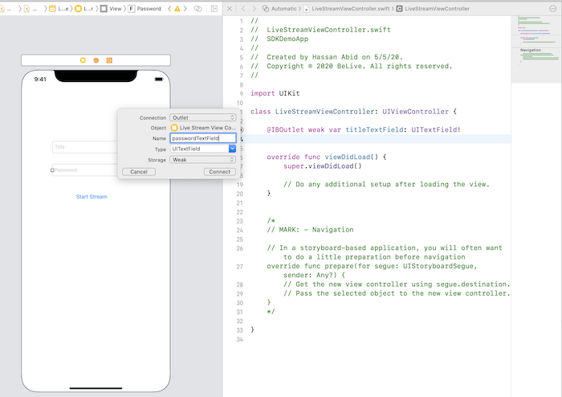

# Advance guide for Custom UI

BeLive iOS SDK has many ready-to-use features and built-in UI. However, if you want to customize UI based on your specific use case, we provide API for building app from ground up.

## Basic Setup

Follow [Quickstart](quickstart.md) for setting up SDK. You can skip step 4 and step 5 of **Start your first Live Stream** and follow steps below. 

## Custom UI for Host / Broadcaster 

1. In Xcode, select project, click File, click New, and then select Cocoa Touch class to create a file and name it `LiveStreamViewController.swift`.



2. In the project navigator, select Main.storyboard. Xcode opens Interface Builder. 

3. Drag a view controller from the Object Library into the canvas. You can filter the list by typing part of the name of the item you’re looking for.



4. In interface builder, select newly added View Controller. Select identity inspector. Add `LiveStreamViewController` as custom class.

5. Open the Object library and drag a uiview object on the interface builder of Live Stream View Controller. Rename it to `PlayerView`. This will be our camera preview.

5. Open the Object library and drag two text field objects onto the Interface Builder canvas. Click to select the Text field and in attribute inspector, change placeholder to `Title`. Do same for other Text field and change placeholder to `Password`.

6. Open the Object library and drag a Button object onto the Interface Builder canvas just below text fields. Double-click to select the Button text and rename it Go Live.

7. Select `Adjust Editor Options` and select `Assistant`. The LiveStreamViewController.swift code opens in the editor.

8. Control-drag from the `PlayerView` object in the canvas to the code and name it `playerView`. 

9. Control-drag from the text fields object in the canvas to the code as shown below.



10. In case button, click control key. You will find some options. Drag from `touch up inside` to the code and name it `didClickStartStream`. It will be an `@IBAction`. We will fill in code here in next steps.

# Start your first live stream

With custom UI, we provide classes and delegate methods which you can use to start and manage life cycle of live stream and live chat. 

## Add `LiveStreamManager` class 

SDK provides `LiveStreamManager` class for managing live stream and chat functionalities. Follow below step-by-step guide to implement it in `LiveStreamviewController`

### Step 1: Initialize LiveStreamManager and LiveStreamDelegate

Add following code in `LiveStreamingViewController` 

```swift
 var liveStreamManager = LiveStreamManager()
    func configLiveStreamManager() {
        liveStreamManager.playerView = self.playerView
        liveStreamManager.parentViewController = self
        liveStreamManager.liveStreamDelegate = self
        liveStreamManager.isBackCamera = false
    }

    override func viewWillAppear(_ animated: Bool) {
        super.viewWillAppear(animated)
        self.configLiveStreamManager()
    }

```

> You will see an error that by compiler about `Add missing conformance to 'LiveStreamDelegate' to class 'LiveStreamViewController'`

Add following extension code in end of `LiveStreamingViewController` class

```swift
     func streamStarted(slug: String) {
         // add code
    }
    func streamStoped(slug: String, endStreamModel: EndStreamModel?) {
        // add code
    }
    func streamError(error: String) {
         // add code
    }
    func streamStatisticUpdated(statisticModel: StatisticModel) {
         // add code
    }
    func streamStatisticError(error: String) {
         // add code
    }
    func receiveMessage(messageModel: MessageModel) {
         // add code
    }
    func didUpdateTitleStream(_ title: String?, _ position: CGPoint, _ colorString: String?) {
         // add code
    }
    func userJoinedMessage(_ messageModel: MessageModel) {
         // add code
    }
    func cameraPositionDidChange(_ position: AVCaptureDevice.Position) {
         // add code
    }
    func startLimitationTimer() {
         // add code
    }
```

We are going to fill in code in delegate methods in next steps. 

## Step 2: Start live stream with title and password

In this step we will add code for starting live broadcoast. `LiveStreamManager` provides following method to start stream 

```swift
/// Creates a Live Stream with title and password.
///
/// - Parameters:
///     - title: The title of the stream.
///     - password: The password of stream (optional)
///     - isLandcape: The orientation of the stream. Default value is `false`. Set `true` for landscape mode
///     - streamMode: The resolution of stream. Option 1 will show SD, HD and FHD
///     - completionHandler: A closure which is called after stream is started or failed to start
///     - streamModel: The `StreamModel` of stream
///     - error: If start stream fails due to some reason, error will be returned.

public func startStream(title: String, password: String, isLandcape: Bool = false, streamMode: Int = 1, _ completionHandler: @escaping (BeLiveSDK.StreamModel?, Error?) -> Void)
```

We added a `didClickStartStream` IBAction in step 10 of `Basic Setup`. Add following code inside `didClickStartStream` method. 

```swift
@IBAction func didClickStartStream(_ sender: UIButton) {
        let isLandscape = false
        self.passwordTextField.resignFirstResponder()
        self.titleTextField.resignFirstResponder()
        if let title = self.passwordTextField.text, passwordTextField.text?.isEmpty == false, let password = self.passwordTextField.text, passwordTextField.text?.isEmpty == false {
            liveStreamManager.startStream(title: title, password: password, isLandcape: isLandscape) { [weak self] (streamModal, error) in
                guard let strongSelf = self else { return }
                if error == nil {
                   // stream started successfully
                // TODO: Update UI using streamModel
                } else {
                    // error in starting stream
                    
                }
            }
        }
    }
```

If stream is started successfully, delegate method `streamStarted` will be called with `slug` parameter.

In case of an error, delegate method `streamError` will be called with `error` string which describes the reason. 

> Note: There is no need to call any method for joining chat channel. We internally call it in SDK. Start listening to any received messages in `receiveMessage` delegate method


### Step 3: Send chat message 

BeLive SDK provides following method to send message. 

```swift
/// Sends chat message in live stream
    ///
    /// - Parameters:
    ///     - message: The content of a message. It should be of `String` type
    ///     - messageType: The type of message. Use `messageType = 1` for normal chat message
    ///                       ```
    ///     - completionHandler: The completion handler which is called when message has been successfully
    ///      sent. A `MessageModel` is passed in as an argument.
    /// - Note: Use `messageType = 1` for normal chat message
public func sendMessage(message: String, _ messageType: Int = 1, _ completionHandler: @escaping (BeLiveSDK.MessageModel?) -> Void)

```
You can add a `UITextField` for user to enter chat message and a `UIButton` to trigger send message `IBAction`. See sample code below 

```swift
@IBAction func sendMessage(sender: UIButton) {
        if let message = self.messageTextField.text, self.messageTF.text?.isEmpty == false {
            self.liveStreamManager.sendMessage(message: message) { (messageModel) in
                self.messageTextField.text = ""
            }
        }
    }

```

### Step 4: Receive Chat message 

`LiveStreamDelegate` provides a method `receiveMessage(messageModel: MessageModel)` for receiving all message types except `statistics` message which is `messageType = 2`. Refer to sample code below for some of the messageTypes

```swift
func receiveMessage(messageModel: MessageModel) {
        print("[SDKSampleApp]Receive message with type: \(messageModel.messageType)")
        switch messageModel.messageType {
        case 201:
               // stop stream (not required for Host)
            break
        case 3:
            // likes / heart animation
            break
        case 6 : 
            // floating text position (not required for Host)
        default:
            // messageType = 1, which is normal chat message 
            print("\(messageModel.message)")
            break
        }
    }

```

### Step 5 : Stop live stream 

Use following function to stop live stream. 

```swift
/// Stops a live stream
    ///
    /// - Parameters:
    ///     - slug: The slug of the live stream
    ///     - completionHandler: A closure which is called when stream is stopped. A bool `finish` is added in argument to indicate success or failure of api call. There will be an `EndStreamModel` passed in as an argument in case of successful api call
    public func stopLiveStream(slug: String, _ completionHandler: @escaping (Bool, BeLiveSDK.EndStreamModel?) -> ())
```

Refer to sample code for stop stream 

```swift
@IBAction func stopStream(sender: Any) {
        if !self.slug.isEmpty {
            self.liveStreamManager.stopLiveStream(slug: slug) { (finish, endStreamModel)  in
                // doUIUpdate()
            }
        }
    }
```

### [Optional] Start OBS Stream 

BeLive SDK provides an option to start stream using professional braodcasting softwares such as OBS or Wirecast. 

Follow below steps for enabling OBS Stream 

1. Before starting stream, set `liveStreamManager.isUseOBS = true`. 

2. Call `liveStreamManager.startStream()` method to start stream. This time it will return a unique slug (key) which can be used to start stream using OBS. We recommend to show a popup with copy to clip board feature. 

3. Once OBS stream is started, initiate following API call otherwise stream will not be available for viewing 

```swift 
self.liveStreamManager.beginStream(slug: self.streamModel?.slug ?? "") { (baseResponse, error) in
                if error == nil {
                } else {
                    print(error.debugDescription)
                }
            }

```

Check more details in `LiveStreamViewController.swift` of sample app.

## Custom UI for Viewer 

Follow the same steps in `Custom UI for Host / Broadcaster` section to create another View Controller and name is as `JoinStreamViewController.swift`. Name the button as `Join Stream` instead of `Start Stream`. 


# Watch your first live stream

With custom UI, we provide classes and delegate methods which you can use to watch live or recorded stream

## Add `LiveStreamViewerManager` class

 Follow below step-by-step guide to implement it in `JoinStreamViewController`

 ### Step 1: Initialize LiveStreamViewerManager and LiveStreamViewerDelegate

 ```swift
var joinStreamManager = LiveStreamViewerManager()
func configLiveStreamViewerManager() {
        self.joinStreamManager.parentViewController = self
        self.joinStreamManager.delegate = self
        self.joinStreamManager.viewPlayVideo = self.playerView
        self.joinStreamManager.setupStreamTitleController()
    }

override func viewWillTransition(to size: CGSize, with coordinator: UIViewControllerTransitionCoordinator) {
        super.viewWillTransition(to: size, with: coordinator)
        self.joinStreamManager.viewerStreamTitleController?.updateLayout()
    }

override func viewDidLoad() {
        super.viewDidLoad()
        
        self.configLiveStreamViewerManager()
        self.joinStreamManager.viewerStreamTitleController?.updateLayout()
    }

 ```


 Add following delegate extension code in end of JoinStreamViewController class


 ```swift
 extension JoinStreamViewController: LiveStreamViewerDelegate {
    func didLoadChatHistory(_ messageModels: [MessageModel?]) {
    }
    
    func didChangeChatHistoryDataSource(_ listRecordedUser: [MessageModel]) {
    }
    
    func userJoinedMessage(message : MessageModel) {
    }
    
    func playerDidPlayFirstFrame() {
    }
    
    func playerDidEnd() {
    }
    
    func playerCurrentTimeDidChange(time: TimeInterval) {
    }
    
    func streamStatisticUpdated(statisticModel: StatisticMessageModel) {
    }
    
    func updateLikeStream(likeCount: Int) {
    }
    
    func leaveStreamSuccess(streamModel: StreamModel?) {
    }
    
    func receiveMessage(message: MessageModel) {
    }
    
    
    func joinStreamSuccess(slug: String, status: Int) {
    }
    
    func joinStreamError(errorMessage: String, errorCode: Int?) {
    }
    
    func joinStreamWithSlugSuccess(slug: String, status: Int) {
    }
    
    func joinStreamWithSlugError(errorMessage: String, errorCode: Int?) {
    }
    
    func streamEndSuccess() {
    }
    
    func streamEndError() {
    }
    
    func leaveStreamSuccess(streamModel: StreamModel) {
    }
    
    func leaveStreamError(errorMessage: String, errorCode: Int?) {
    }
    
}


 ```

 We are going to fill in code in delegate methods in next steps.

 ## Step 2: Join live stream with title and password

`LiveStreamViewerManager` provides following two methods to join stream with either title and password or slug

```swift
public func joinStream(titleRoom : String, passWordRoom: String, _ completionHandler: @escaping(StreamModel?)-> Void)

public func joinStreamWithSlug(_ slug: String, _ completionHandler: @escaping(StreamModel?)-> Void)
```

Find below an example from sample code of joining stream with title and password.
 ```swift
 @IBAction func joinStream(sender: Any) {
        self.joinBtn.isUserInteractionEnabled = false
        self.passwordTF.resignFirstResponder()
        self.titleTF.resignFirstResponder()
        if let title = self.titleTF.text, titleTF.text?.isEmpty == false , let password = self.passwordTF.text, passwordTF.text?.isEmpty == false {
            self.joinStreamManager.joinStream(titleRoom: title, passWordRoom: password) { [weak self] (streamModel) in
                guard let strongSelf = self else { return }
                // TODO : Update Logic
            }
        }
 }

 ```

 Refer to following callbacks for joining live or recorded stream successfully. 

```swift 
func playerDidPlayFirstFrame() {
        //First video frame is loaded
        //Update UI
}
```

Viewer is successfully connected to live chat channel. Refer to below callback.
```swift
func joinStreamSuccess(slug: String, status : Int) {
        //show Chat UI if success
}
```

### Step 3: Send chat message 

This part is same as that of Host.

### Step 4: Receive Chat message 

This part is same as that of Host.

### Step 5 : Leave live or recorded stream

Refer to following function for leaving stream

```swift
func stopStream(streamModel: StreamModel?, _ completionHandler: @escaping (_ finish: Bool)->())
}

Refer to following sample code in `LiveStreamViewerManager`

```swift
@IBAction func stopStream(sender: Any)
```


## Picture-in-picture mode

BeLive SDK supports picture-in-picture mode. It is by default added in built-in UI. For custom UI, add `PIPViewControllerProtocol` delegate in Viewer controller. 

> Note : Picture-in-picture is only supported for viewer

Refer to example `PIPViewControllerProtocol` delegate code in `JoinStreamViewController` of sample app 

```swift
//MARK: PIPViewControllerProtocol

extension JoinStreamViewController: PIPViewControllerProtocol {
    var slug: String {
        get {
            return "slug"
        }
        set(newValue) { 
        }
    }
    
    var isLandscapeSupport: Bool {
        get {
            return false
        }
    }
    
    func pipClose(complete: @escaping () -> ()) {
        self.joinStreamManager.stopStream(streamModel: self.streamModel) { [weak self] _ in
            guard let _ = self else { return }
            complete()
        }
    }
    
    func pipZoomOut() {
        self.updateOnPIPChanged()
    }
    
    
}
extension JoinStreamViewController {
    
    func updateOnPIPChanged () {
        self.joinStreamManager.updatePlayerView(self.playerView.frame) { [weak self] in
            guard let _ = self else { return }
            // keep state of pip
        }
    }
}

```

To start pip mode, refer to following function in sample app

```swift
func enterPIPMode() {
        PIPManager.sharedPIPManager().minimize(changeToPortrait: true) { [weak self] in
            guard let self = self else { return }
            self.updateOnPIPChanged()
        }
    }
```

If you are using pip mode, make sure to close pip when user exits out of stream

```swift
PIPManager.sharedPIPManager().closePIPSupportedScreen()
```

See sample code for more details about inegrating `PIP` in your project.