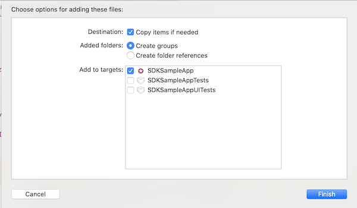
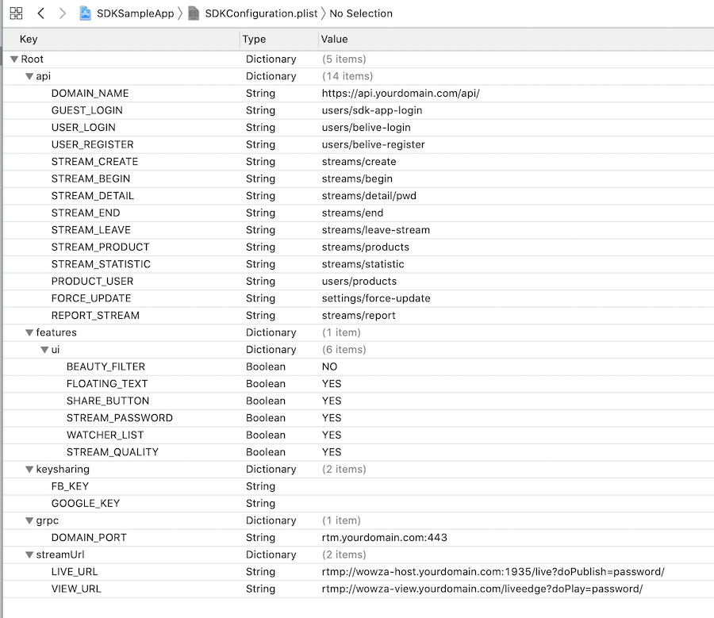
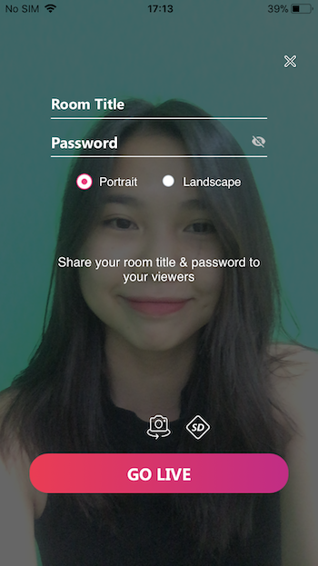
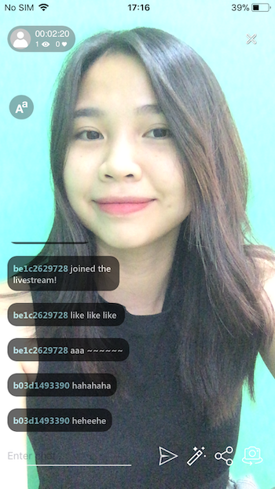
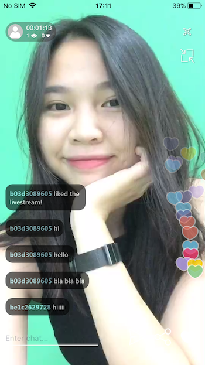
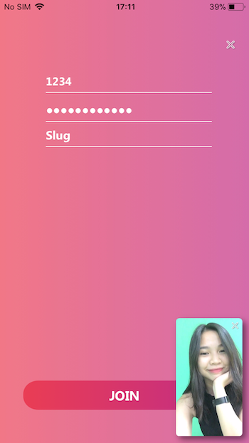

# Quick Start
This quick start shows a brief overview of the BeLive SDK's structure and features, then goes through the preliminary steps of integrating the BeLive iOS SDK in your own project.

## Sample App

Our sample application demonstrates the capabilities and core features of the BeLive SDK for iOS. It is provided for developer educational purposes. Contact our [Business team](https://www.tech.belive.sg/contact-us) for source code. You can use it as starting point for building new app. 

## Requirements 

The minimum requirements for BeLive SDK for iOS are:

- `BeLiveSDK.framework`
- `iOS 10.0 and higher`
- `Swift 4.0 and higher`

## Install and configure BeLive SDK

Follow the below steps to integrate BeLive SDK framework in your app.

### Step 1: Install SDK 

Drag and drop `BeLiveSDK.framework` in your Xcode Project. Refer to below screenshot



> In `Frameworks, Libraries, and Embedded Content` section of build target, select `Embed & Sign` unded Embed option.

### Step 2: Add SDK condiguration plist

Add `SDKConfiguration.plist` in your project. We have provide a sample `plist` file in Sample project.

> If you haven't deployed api, chat and streaming servers, you can use `endpoints` that we have provided in Sample app for testing. 

BeLive SDK has plenty of features. By default all features are enabled. You can disable them in `features` section of `SDKConfiguration.plist`. See screenshot below



### Step 3: Install the open source libraries using CocoaPods

1. Install CocoaPods into your project by running `pod init` in your project directory. (You can skip this step if you have podfile already in your project)
2. Open `Podfile`
3. In the opened Podfile, include following pods under your project target and run `pod install` command.

**Host and Viewer**

> Note : Host and Viewer use same libraries as of now. If HLS playback is preferred, then we won't be needing `Live Streaming` libraries for viewer side.

```bash

   #MARK: - Network
    pod 'Alamofire', '4.9.1'
    pod 'AlamofireObjectMapper', '5.2.1'
    pod 'SDWebImage', '5.11.0'
     
    #MARK: - Live Streaming (If HLS playback is preferred, then we won't be needing Live Streaming libraries for Viewer side).
    pod 'libksygpulive', '3.0.4'
    pod 'GPUImage', '0.1.7'  

    #MARK: - Chat - in-House (gRPC)
    pod 'SwiftGRPC', '0.11.0'
    pod 'gRPC', '1.24.2'
    pod 'pop', '1.0.12'

    #MARK: - Chat - Agora RTM
    pod 'AgoraRtm_iOS', '1.4.3'

    #MARK: - Util - For UI
    pod 'ObjectMapper', '3.5.3'
    pod 'PromiseKit', '6.13.1'
    pod 'IQKeyboardManagerSwift', '6.5.6'
    pod 'Toast-Swift', '5.0.1'
    pod 'SnapKit', '5.0.1'
    pod 'SVProgressHUD', '2.2.5'
    pod 'SwiftyPlistManager', '1.0.2'

    #MARK: - Reactive extensions - Rx
    pod 'RxSwift', '5.1.2'
    pod 'RxCocoa', '5.1.1'
    pod 'RxRelay', '5.1.1'
    pod 'RxAppState', '1.6.0'
    pod 'RxReachability', '1.1.0'
    
    #MARK: - License - CryptoSwift
    pod 'CryptoSwift', '1.3.8'

    #MARK: Social sharing (optional)
    pod 'FBSDKCoreKit'
    pod 'FBSDKLoginKit'
    pod 'FBSDKShareKit'
    pod 'TwitterKit5'
    pod 'TwitterCore'
```

> Note that due to `ITMS-90809: Deprecated API Usage - Apple will stop accepting submissions of apps that use UIWebView APIs `, you must use `RxSwift`, `RxCocoa`, `RxRelay` version above 5.0.0

## Start your first Live Stream

BeLive iOS SDK adds live streaming feature to your client app with few lines of code. To start or watch your first live stream, do the following steps. 

### Step 1: Verify license key

Obtain license key from business team by providing your bundle Id. Add folowing lines of code in `ViewController.swift` for completing the verification of license key.

```swift
class ViewController: UIViewController {
    
    fileprivate let licenseKey = "license_key"
    
    override func viewDidLoad() {
        self.checkLicenseKey(bundleAppID,licenseKey) { [weak self] (success) in
            guard let strongSelf = self else { return }
            if success {
                    // license key is verified
                    let userId = "b\(strongSelf.uid)i".lowercased()
                    strongSelf.loginWithBeliveID(beliveID: userId.lowercased()) { (success) in
                        // login success 
                        canStartLive = true
                }
            } else {
                // license key is invalid
            }
        }

    }
}
```

### Step 2: Login to BeLive SDK 

After verification of login, you must login to BeLive SDK before starting live stream controllers. Use following method for login and register. 

```swift
//MARK: - Login with Belive ID.

func loginWithBeliveID(beliveID: String,_ completion: @escaping (_ success: Bool)->()) {
    
    let userManager = UserAPIManager.sharedUserManager()
    fileprivate let userManager = UserAPIManager()
    fileprivate let cryptoLicense = CryptoLicense.shared

    userManager.loginWithBeliveId(beliveID,uid) { [weak self] (baseUserResponse, error) in
        guard let strongSelf = self else { return }

        if (baseUserResponse?.code == 652) { // User not found in databsae
            // Register new user
            let userName = "user\(Int.random(in: 900000 ..< 10000000))"
            let profilePic = "profile.jpg"
            userManager.registerNewUser(beliveID, strongSelf.uid, userName, userName, profilePic) { (baseUserResponse, error) in
                if(baseUserResponse?.code == 1) {
                    if error == nil {
                        userManager.userProfile = baseUserResponse?.data
                        // Registered successfully
                        completion(true)
                    }
                    else {
                        // failed to register
                        completion(false)
                    }
                }
            }
        } else {
            userManager.userProfile = baseUserResponse?.data
            if error == nil {
                completion(true)
            }else {
                completion(false)
            }
        }
    }
}

```

### Step 3: [Optional] Fetch and Add `SDKConfiguration.plist` values 

You can modify or add new key-values to `SDKConfiguration.plist`

```swift

 func configuration() {
 //fetch
        var fetchedValue = SwiftyPlistManager.shared.fetchValue(for: "api", fromPlistWithName: "SDKConfiguration") as! [String: Any]
        
        //set value
        fetchedValue["LOGIN"] = "users/sdk-app-login"

        //save to plist file
        SwiftyPlistManager.shared.save(fetchedValue, forKey: "api", toPlistWithName: "SDKConfiguration") { (err) in
          if err == nil {
           // Value successfully saved in plist
          }
        }

        //add new key-value
        SwiftyPlistManager.shared.addNew("NewValue", key: "newKey", toPlistWithName: "SDKConfiguration") { (err) in
          if err == nil {
            // Value successfully added in plist
          }
        }
 }

```

### Step 4: Start Live Stream 

Use following snippet of code for starting live stream 

```swift
import SwiftyPlistManager
import BeLiveSDK

class ViewController: UIViewController {
    var bundlePath: String?
    var bundleAppID = Bundle.main.bundleIdentifier!

    override func viewDidLoad() {
        //load bundle of framwwork
        let file = String(format: "%@/%@/%@", Bundle.main.resourcePath!,"Frameworks","BeLiveSDK.framework")
        bundlePath = file


    }

    //MARK: - Start Live Stream
    
    @IBAction func actionGoLive(_ sender: Any) {

        let pageViewController = PageViewController(nibName: "PageViewController", bundle: Bundle(path: self.bundlePath!))
                self.navigationController?.pushViewController(pageViewController, animated: true)
    }

}

```

Screenshots of built-in UI

 | 


### Step 5: Watch Live Stream

Use following snippet of code for watching live stream 

```swift
//MARK: - Watch Live Stream
@IBAction func actionJoin(_ sender: Any) {
        let joinRoomViewController = JoinRoomViewController(nibName: "JoinRoomViewController", bundle: Bundle(path: self.bundlePath!))
         // uncomment following code to disable title and password field
        // let slug_id = "d3709cbba6a94a3eb31d12a10229d8c8"
        // joinRoomViewController.slug = slug_id
        self.navigationController?.pushViewController(joinRoomViewController, animated: false)
}
```

Screenshot of built UI

 | 

## Carthage Support

BeLive SDK supports carthage as well. Our iOS team will help you to get started with it.

## Custom UI

> For advance guide with custom UI, visit [iOS guide with Custom UI](Advance.md)
