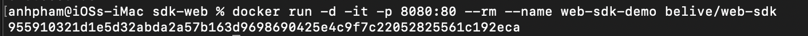
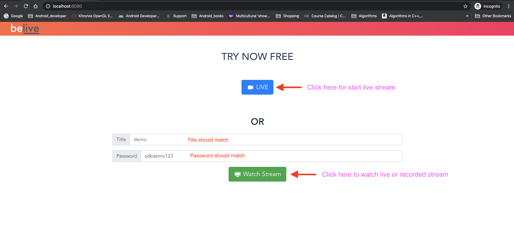
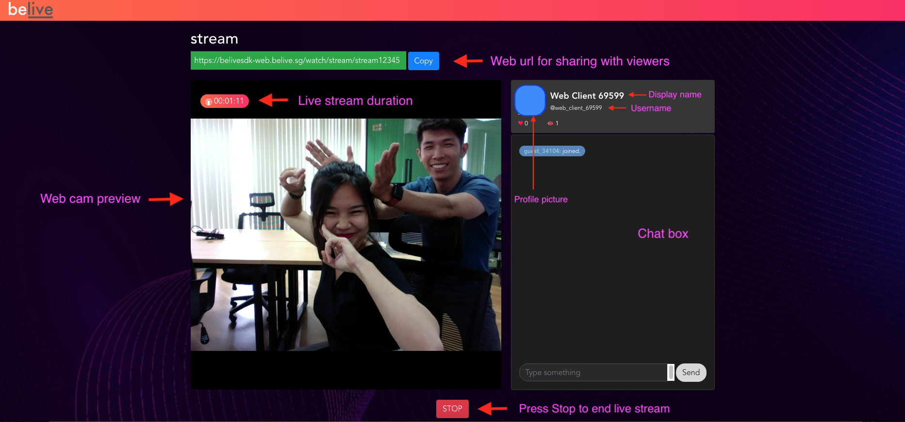
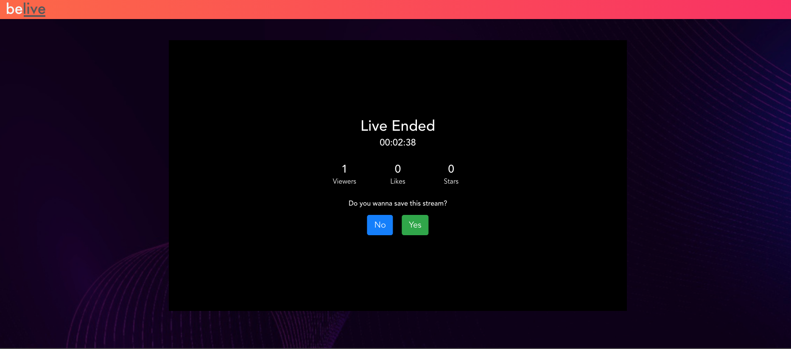
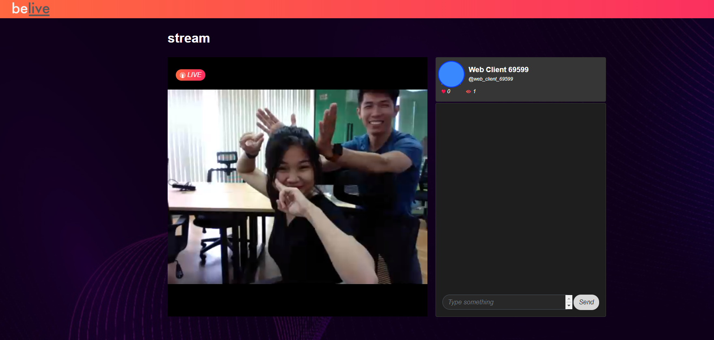
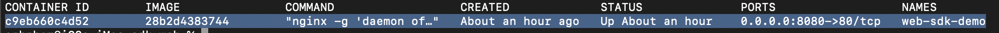

# Quick Start for BeLive Web SDK

Simple and easy way to use BeLive Web SDK is by deploying docker image on your infrastructure. 

## How to load and run Docker Image

1. Install docker from [https://docs.docker.com/docker-for-mac/install/](https://docs.docker.com/docker-for-mac/install/) (Mac Version)
2. Download Web docker image (Web folder) from Google drive link. Unzip it, you will find web-sdk.tar file. Contact our [Business team](https://www.tech.belive.sg/contact-us) for Google drive link
3. Open a command-line terminal and change directory to same with `web-sdk.tar` file. Run following command to load docker

```bash
$ docker load --input path_to_docker_image/web-sdk.tar
```

  4. After having docker image loaded, run following cmd to start Dockerized web server.

```bash
$ docker run -d -it -p 8080:80 --rm --name web-sdk-demo belive/web-sdk
```

If you see output as string hash, it means web server started successfully!



## Explore the Web Sample

- In a web browser, go to  [http://localhost:8080](http://localhost:8080/) to view landing page. Because we specified the **default HTTP port**, it's not necessary to append `:80` at the end of the URL.

    

    - Press Live for starting live stream. Enter title and password and press live button below player
    - To stop live stream, press stop. User will be presented with option to save recorded stream.

    

    

    - To watch a live or recorded stream, Enter title and password. Press `Watch stream` button.

    

    In case of live stream. chat functionality will be available

    

    In case of recorded stream playback. live chat functionality is not available


## Config Parameters

| Parameter Name             | Description         | Example                                       |
| Parameter Name             | Description         | Example                                       |
|----------------------------|---------------------|-----------------------------------------------|
| BELIVESDK_WEB_APP_KEY      | Web Sdk License Key | web_app_key |
| BELIVESDK_WEB_APP_ENDPOINT | Web App Endpoint    | https://web.yourdomain.com/              |
| BELIVESDK_WEB_APP_BASE_URL | API Base Url        | https://api.yourdomain.com/api                |
| BELIVESDK_WEB_APP_SDP_URL  | Session Description Protoco URL | wss://wowza.yourdomain.com/webrtc-session.json |
| BELIVESDK_WEB_APP_NAME     | Wowza web app name  | Use `live` |
| WOWZA_PLAYER_LICENSE       | Wowza Player License | Get it from wowza website after registration | 
| BELIVESDK_WEB_CHAT_ENDPOINT | Web Chat endpoint | `rtm.yourdomain.com:1010` |
| BELIVESDK_WEB_CHAT_KEY    | Web Chat license key | web_chat_key |

Sample config parameters included in above docker image (Please replace with your own config)

```jsx
const BELIVESDK_WEB_APP_KEY = 'web_app_key';
const BELIVESDK_WEB_APP_ENDPOINT = 'api_base_url';
const BELIVESDK_WEB_APP_BASE_URL = 'http://localhost:8080';

// #Configs for wss sdp
const BELIVESDK_WEB_APP_SDP_URL = 'wowza_sdp_url';
const BELIVESDK_WEB_APP_NAME = 'live';
	
// #Wowza player:
const WOWZA_PLAYER_LICENSE = 'wowza_license_key';

const BELIVESDK_WEB_CHAT_ENDPOINT = 'chat_domain_port';

const BELIVESDK_WEB_CHAT_KEY = 'web_chat_key';
```

## Custom Config

If you want to update config, follow below steps

1.  Create file: `settings.js` **(DON'T CHANGE FILENAME)**
2. Update your config values(**pls don't change the name of parameter**). See parameters names above for your reference.
3. After update your setting, run following command to copy it to container:

    ```bash
    $ docker cp path_to_your_setting_file/setting.js docker_container_id:/app/sdk/dist/static/js/setting.js
    ```

    > Note :To get docker_container_id, run following command

    ```bash
    $ docker ps
    ```

    Copy `CONTAINER ID` of web-sdk-demo.

    

    ---

## Update style

To use your own custom css, follow below steps

1. Create a file: `custom.css` **(DON'T CHANGE FILENAME)**
2. Modify style `classes` and `ids` as shown below

    Example:

    ```css
    /* Modify main page*/
    .belive-main-page {
    	background: #1e1e1e;
    	color: white;
    }

    /* Modify live/watch page */
    html #app .main-page.bg-page-wrapper.belive-main-page.bg-page-wrapper {
    	background-color: #1e1e1e;
    	background-image: unset;
    }

    /* Modify home page */
    .belive-home-page {
    }

    /* Modify live page */
    .belive-live-page {

    }

    /* Modify watch page */
    .belive-watch-page {

    }
    ```

3. After modifying style classes and ids, run following command to copy them to docker container

```bash
$ docker cp path_to_your_custom_file/custom.css docker_container_id:/app/sdk/dist/static/css/custom.css
```

If you want to stop web server, run following command

```bash
$ docker stop CONTAINER_ID
```

---

## Browser Compatibility

> WebRTC is supported on chrome therefore you can start live on Chrome desktop version only at this moment

> For watching live stream, We use both HLS and WebRTC, so it is supported on most of desktop and mobile browsers
